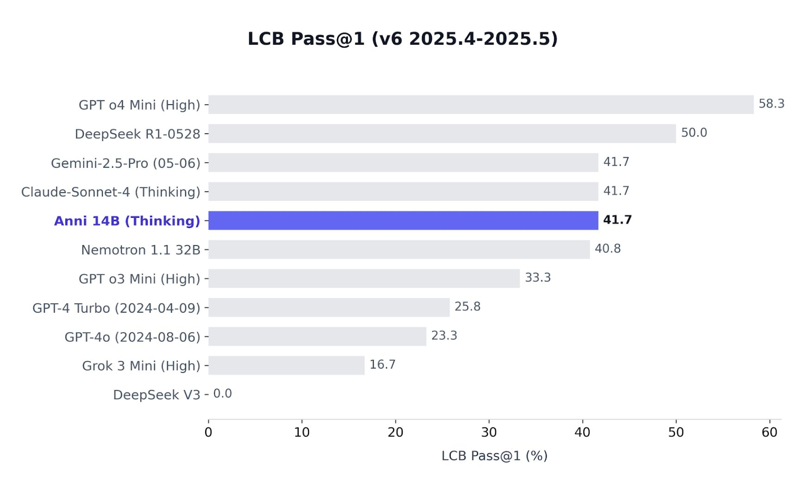

<div align="center">


# Anni

<p>
  <a href="https://huggingface.co/BigJuicyData/Anni" target="_blank"></a>&nbsp;<a href="https://modelscope.cn/models/quanteat/Anni" target="_blank"></a>&nbsp;<a href="https://github.com/CoderUni/Anni/actions/workflows/codeql.yml" target="_blank"></a>&nbsp;<a href="https://github.com/CoderUni/Anni/blob/main/LICENSE" target="_blank"></a>
</p>

<br />

**Anni** is a high-performance code assistant built on the **Qwen3 14B** architecture. <br />
Fine-tuned on **OpenCodeReasoning-2**, it is engineered to excel in deep algorithmic reasoning, complex data structure implementation, and competitive programming.

[View Demo](#-demo) • [Quick Start](#-quick-start) • [Benchmarks](#-benchmarks) • [Training](#-development-setup)

</div>

---

## ✨ Key Features

| Feature | Description |
| :--- | :--- |
| 🧠 **Deep Reasoning** | Optimized for hard logic puzzles and algorithmic challenges. |
| ⚡ **High Efficiency** | Supports **vLLM** serving and **GGUF** for consumer hardware. |
| 📚 **Large Context** | **32k context window** for processing extensive codebases. |
| 🛠️ **Dev Ready** | Comes with full training scripts, merging tools, and a web UI. |

---

## 🎥 Demo

<div align="center">

https://github.com/user-attachments/assets/8898633f-fdc8-46db-887d-6bb50569be47

  <p><em>Anni solving a <a href="https://leetcode.com/problems/dungeon-game">hard-difficulty LeetCode problem</a> in real-time</em> (1x speed on a <strong>single L40 GPU</strong>)</p>
</div>

---

## 🚀 Quick Start

Experience Anni immediately without local setup using Google Colab.

| method | link | description |
| :--- | :--- | :--- |
| **GGUF (Recommended)** | [](https://colab.research.google.com/drive/16RKUtphbI1rAds_lLwPGk2cRhf9CDJDo?usp=sharing) | Run standard inference on free tier GPUs. |
| **vLLM Serving** | [](https://colab.research.google.com/drive/1lXYtLT729qcxJPc56TllgwiGEsjIiW0Q?usp=sharing) | High-throughput serving using vLLM. |

---

## 📊 Benchmarks

Anni was evaluated on **LiveCodeBench (LCB)**, demonstrating superior performance in code generation and reasoning tasks compared to base models.

<div align="center">
  
</div>

---

## 🛠️ Development Setup

If you wish to fine-tune or run Anni locally, follow these steps.

### 1. Prerequisites
Ensure `tmux` is installed.
```bash
pip install -r requirements.txt
```

### 2. Configuration
Set up your environment variables for WandB, HuggingFace, and ModelScope.

```bash
mv config/example.env config/.env
# Open config/.env and paste your API keys
```

Edit `config/config.yaml` to adjust hyperparameters.

Note: Specify the `LOCAL_STORAGE_PATH` in `src/train.py` before starting.

### 3. Training
Launch the training pipeline:

```bash
./scripts/train.sh
```

## 📂 Project Structure
```
Anni/
├── config/                 # Configuration files
│
├── scripts/                # Shell scripts for automation
│   ├── train.sh            # Start training pipeline
│   ├── eval.sh             # Run LiveCodeBench evaluation
│   ├── serve.sh            # Spin up vLLM server
│   └── terminate_train.sh  # Kill training processes
│
├── src/                    # Python source code
│   ├── preprocess.py       # Downloads & preps OpenCodeReasoning-2
│   ├── train.py            # Main fine-tuning logic
│   ├── save.py             # Merges LoRA adapters (BF16 & GGUF)
│   ├── inference.py        # Run inference with the fine-tuned model
│   ├── upload.py           # Pushes to HF/ModelScope
│   └── utils/              # Utility functions
│
└── web/                    # Frontend Interface
```
👉 [View Frontend Documentation](https://github.com/CoderUni/Anni/tree/main/web)

## ⚖️ License & Disclaimer

### License

- **Model Weights & Training Code:** Released under the MIT License.

- **Trademarks:** The project name (**Anni**), assets, and frontend code are trademarks of the owner (Hans) and may not be used without explicit permission.

### Dataset Attribution

- Trained on [OpenCoderReasoning-2](https://huggingface.co/datasets/nvidia/OpenCodeReasoning-2) (CC-BY-4.0).

**Disclaimer**: This model may generate incorrect or unsafe code. Evaluate and verify outputs before using in production environments.
